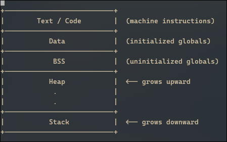
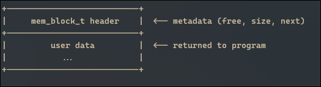
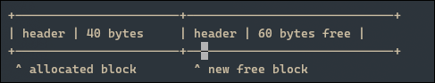
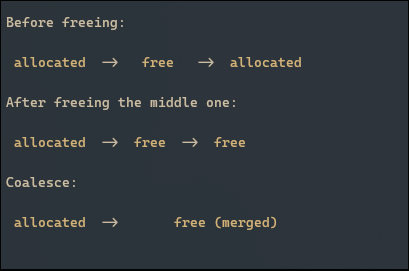

# Understanding Memory Allocators 
In my quest of understanding how systems work i built a very basic and simple memory allocator. If you are a beginner this might sound like a real tough thing to do but it really is not.

A memory allocator is simply a program that manages the internal address space(memory layout) of a process. Huh?... Addres space? What is that? What we call address space is just a clever abstraction of physical memory that makes it easier for us to program. It is basically how a program sees memory when it is running. Every running procees has it's own address space(representation of memory) that belongs to it alone.

A process address space is divided into disctinct sections: the code, data, bss, stack and heap. You might have already heard of the stack and heap if you ever took a programming course.The stack is where local variables, functions return addresses and more are stored. The heap is the dynamically allocatable part of the memory and where dynamically allocated objects are stored.

A process address space usually looks something like this:



To know more about the code, data and bss sections go [here](https://mirzafahad.github.io/2021-05-08-text-data-bss/).

## How Memory Allocators Work
Memory Allocators are responsible for managing the heap. This is done by building an abstraction of the heap as a sequence of blocks of arbitrary size. The Memory allocator can then reserve blocks of any given size for your program, make them bigger or smaller, request more blocks from the os etc to meet the demands of your program.

## Building the Abstraction: The block
The Simplest representation of a block you can find is something like this:
```cpp 
 typedef struct mem_block{
    bool free;
    size_t size;
    struct mem_block* next = nullptr;
}mem_block_t;

#define MEM_BLOCK_SIZE sizeof(mem_block_t)   
```
Each block has a free attribute which represents whether it has been allocated already or not, size attribute holds the address of the next block after it. 
If for example the program requests a 64 byte block, a `mem_block_t` object will be instantiated and free will be set to false, size will be set to 64 and the starting address of the next block can easily be computed as the starting address of this block + the size of this block. The address of this block is then returned to the user and the space(64 bytes) between the two blocks is now reserved for use.

A block in the heap looks like this in memory:




And when multiple blocks are chained:


## Iniatializing memory pool

Before we have any space on the heap to manage we need to request some from the OS. To do that we can either provide a function for the user to call or do what we call lazy initialization. Lazy initialization is an elegant technique where we request for the resource the first time the user calls our allocate function. This provide the advantages that we only request the resource when the program really needs to use it and that now the user does not have to worry about these details, they merely have to call allocate and free whenever they wish. 

Here is the code for lazy initialisation:
```cpp
#define INITIAL_BLOCK_SIZE  1024
#define STARTING_SIZE INITIAL_BLOCK_SIZE+MEM_BLOCK_SIZE


mem_block_t* head = nullptr;

void init_mem_pool() {
    head = (mem_block_t*) sbrk(STARTING_SIZE);
    if(head == (void*) -1) {
        head = nullptr; // sbrk failed
        return;
    }
    head->size = INITIAL_BLOCK_SIZE;
    head->free = true;
    head->next = nullptr;
}

void* mem_alloc(size_t size){
    if(head == nullptr) {
        init_mem_pool();
    }
    ...
}

```

The pointer `head` is initialised to nullptr so the very first time the user calls `mem_alloc` the if statement evaluates to true and our `init_mem_pool` function is called. This function uses the `sbrk` system call to change the ending address of the heap. To know more about `sbrk` check the [man pages](https://linux.die.net/man/2/sbrk).

We request an initial block of 1024 bytes + `MEM_BLOCK_SIZE` to hold the metadata(size, free and next ptr). We then set all the attribute values to their defaults and that's it.

## Allocating Memory
At this point we have defined what a block is and how to initialize our memory pool. The start state is one big block of 1024 bytes that is free. As user request blocks and frees them there will be multiple blocks all of different sizes. To allocate a block we then need to search through the list and find a suitable block that can accomodate the requested amount. There are various strategies to find suitable blocks, namely: first fit, best fit and next fit. The first fit strategy is the simplest, we simply traverse the list until we find the first block big enough to accomodate the request. The best fit strategy involves traversing the whole list and find the best block that matches the request and in the next fit stategy you keep track of what the last allocated block was and start the search from there rather than from the head of the list.

I implemented a first fit strategy because it is the simplest in my opinion. So to allocate a block we need to start traversing from the head and for each block check if it is large enough to accomodate the request. If No block is found we request more memory from the OS. If we do find one we do one of two things:

- If the size of the block matches exactly the request then we return the address of that block directly.
- If the block is larger than what was requested we split the block into two seperate blocks and then return the address of the half that matches perfectly. like this:

Before splitting (current block of size 100):


User requests 40 bytes.

After splitting:




Here is the full code:
```cpp 
void* mem_alloc(size_t size){
    
    if(head == nullptr) {
        init_mem_pool();
    }
    mem_block_t* current = head;
    mem_block_t* prev = nullptr;
    
    //traverse list to find an equal size or larger block
    while(current != nullptr){
       if(current->free && current->size == size){
            //Found an equal size block
            current->free = false;
            return (void*)(current + 1);
       }else if(current->free && current->size > size){
            //found a larger block,try to split
            size_t remaining_size = current->size - size;
            if(remaining_size <= MEM_BLOCK_SIZE){
                //Not enough space to split, allocate entire block
                current->free = false;
                return (void*)(current + 1);
            }

            //splitting block
            mem_block_t* new_block = (mem_block_t*)((char*)(current + 1) + size);
            new_block->free = true;
            new_block->size = current->size - size - MEM_BLOCK_SIZE;
            new_block->is_aligned = false;
            new_block->next = current->next;

            //update current block
            current->free = false;
            current->size = size;
            current->is_aligned = false;
            current->next = new_block;
            return (void*)(current + 1); 
       }
       prev = current; 
       current = current->next;
    };

    //traversed list and No suitable block found, request more memory
    mem_block_t* new_block = (mem_block_t*) sbrk(size + MEM_BLOCK_SIZE);
    if(new_block == (void*) -1) {
        return nullptr; //sbrk failed
    }
    new_block->size = size;
    new_block->free = false;
    new_block->is_aligned = false;
    new_block->next = nullptr;
    
    //Link the new block
    if (prev != nullptr) {
        prev->next = new_block;
    } else {
        head = new_block;  // This would be the first block
    }
    return (void*)(new_block + 1);
}

```
## Byte Alignment
At this point you should have a working allocator. However there is still work to do, a working allocator does not mean a correct one. An important piece is missing and that piece is called Byte Alignment.

Mordern CPUs do not load data one byte at a time. Most personal computers today have a 64-bit CPU with a 64 bit which means 8 bytes are moved in one go. 
Okay but why is this important to us? That's because the memory hardware only performs reads at aligned boundaries. I can't just start rather from any arbitrary address. Imagine a user requests 8 bytes of memory and our allocator returns address 5. Suppose the user has wants to read from that location, The CPU will start reading from a fixed address like 4 and will read 8 bytes leaving 1 byte of data unread. So to read the whole 8 bytes the CPU does two memory cycles rather than one if we had returned address 8 for example. You do know how expensive memory cycles are right? That's a huge performance loss. Most programmers will be very angry with our allocator and that's why it matters to us .

Another important thing is for many cases programmers want to request their own alignment. For example a user can say "I want the address to be a multiple of 16" or "I want it to be a multiple of 32" and so on. Hence we need our allocator to support such requests. So on top of the `mem_alloc` function we can add an alignment layer. 

First Let's define what alignments we support.
```cpp
#include <cstddef>
#pragma once

enum Alignment : size_t {
    ALIGN_1   = 1,
    ALIGN_2   = 2,
    ALIGN_4   = 4,
    ALIGN_8   = 8,
    ALIGN_16  = 16,
    ALIGN_32  = 32,
    ALIGN_64  = 64,
    ALIGN_128 = 128,
    ALIGN_256 = 256,
    ALIGN_512 = 512,
    ALIGN_1024= 1024,
    ALIGN_NATURAL = alignof(std::max_align_t)
};

enum AlignmentForType {
    ALIGN_CHAR        = ALIGN_1,
    ALIGN_SHORT       = ALIGN_2,
    ALIGN_INT         = ALIGN_4,
    ALIGN_LONG        = ALIGN_8,
    ALIGN_LONG_LONG   = ALIGN_8,
    ALIGN_FLOAT       = ALIGN_4,
    ALIGN_DOUBLE      = ALIGN_8,
    ALIGN_LONG_DOUBLE = ALIGN_16,
    ALIGN_POINTER     = ALIGN_8,
    ALIGN_OBJECT      = ALIGN_NATURAL
};

```
We have defined our Alignment structures now we need to write the alloc function. We want the function to take a size and an Alignment Requirement as arguments and return an address that is aligned with that.

```cpp
void* mem_alloc_align(size_t size, Alignment alignment = Alignment::ALIGN_NATURAL){
    //from alignment type get actual value
    size_t align_val = static_cast<size_t>(alignment);

    //we need to request space for:
    //1) the aligned block itself (size)
    //2) space to store the original unaligned pointer(we need it for free later)(sizeof(void*))
    //3) Padding to acheive the alignment(align_val)
    size_t total_size = size + sizeof(void*) + align_val;
    
    //get unaligned block
    void* unaligned = mem_alloc(total_size);
    if(!unaligned) return nullptr;

    //compute alignment
    uintptr_t raw_addr = reinterpret_cast<uintptr_t>(unaligned);
    uintptr_t aligned_addr = (raw_addr + sizeof(void*) + align_val-1) & ~(align_val - 1);

    //store original ptr just before aligned block
    void** block_ptr_location = reinterpret_cast<void**>(aligned_addr-sizeof(void*));
    *block_ptr_location = unaligned;

    return reinterpret_cast<void*>(aligned_addr);
}

void* mem_alloc_align_type(size_t size, AlignmentForType type_alignment){
    return mem_alloc_align(size, static_cast<Alignment>(type_alignment));
}

```

Great Job. Now our allocator supports alignment and can be considered a correct allocator. The last piece of the puzzle is the free function to release all the resource we requested.

## Freeing Memory
Every alloc function needs a free counterpart to release the memory when no longer in need. The free function has one simple job which is to mark the block as free. yep that's it. It doesn't need to return the memory to the OS since it might be needed again in the future. By simply marking it as free it becomes usable again within the program. One additional functionality is free is to do some house keeping, when memory is freed it should check if it is next to other free blocks. If it is then we can combine the free blogs into one to reduce internal fragmentation. This process is called Coalescing memory. Here it is what it visually looks like:




Here is the full free code: 
```c 
void mem_free(void* ptr) {
    if(ptr == nullptr) return;
    
    mem_block_t* block = (mem_block_t*)ptr - 1;
    void* actual_ptr = ptr;
    
    if(block->is_aligned) {
        void** back_ptr = reinterpret_cast<void**>(ptr) - 1;
        actual_ptr = *back_ptr;
        block = (mem_block_t*)actual_ptr - 1;
    }
    block->free = true;

    //Coalesce adjacent free blocks on the right
    if(block->next != nullptr && block->next->free) {
        //update size to be sum of both blocks
        block->size += MEM_BLOCK_SIZE + block->next->size;
        //update next pointer to next of the next block
        block->next = block->next->next;
        //they are now 1 block
    }

    //do same for block on the left
    mem_block_t* current = head;
    while(current->next != nullptr) {
        if(current->next == block){
            if(current->free) {
                current->size += MEM_BLOCK_SIZE + block->size;
                current->next = block->next;
            }
            break;
        }
        current = current->next;
    }
}
```

As you must have noticed for aligned blocks we move the pointer 1 block back to find the actual pointer that was returned by `mem_alloc`. For that we added a boolean property to the block structure and when an aligned block is allocated it should be set to true. We leave that as an exercise to the reader.

## Missing Piece
Great work if you made it this far. This allocator contains all the elements of what would be considered a correct allocator. However there is still one piece i deliberately left out for you to work on. That is thread safety. The current allocator is not thread safe. If a program running multiple threads tries to allocate memory concurently you are basically guaranteed to be screwed. How to fix that? Give it a try. 

You can read about thread safety [here](https://en.wikipedia.org/wiki/Thread_safety) or [here](https://grokipedia.com/page/Thread_safety). For the C++ specifics here is a [hint](https://en.cppreference.com/w/cpp/language/raii.html).
You can also just read the full code [here](https://github.com/ibrahimamam1/memcpp)

Thank you for reading. See you next time.
